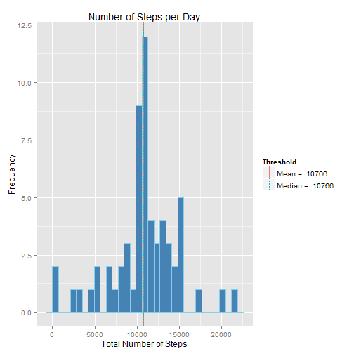

### By: Muhammad Haseeb Ahmad


## Loading and preprocessing the data
Load and preprocess the data using:

```r
library(lubridate)
library(dplyr)

# Read only the desired file from the zipped folder
data <- read.csv(unz('activity.zip', 'activity.csv'), stringsAsFactors = F)

# Create a separate date-time variable for time-series plots
data$interval = formatC(data$interval, width = 4, flag = 0)
data <- mutate(data, dateTime = ymd_hms(paste(data$date, data$interval),
                                        truncated = 2))
head(data)
```

```
##   steps       date interval            dateTime
## 1    NA 2012-10-01     0000 2012-10-01 00:00:00
## 2    NA 2012-10-01     0005 2012-10-01 00:05:00
## 3    NA 2012-10-01     0010 2012-10-01 00:10:00
## 4    NA 2012-10-01     0015 2012-10-01 00:15:00
## 5    NA 2012-10-01     0020 2012-10-01 00:20:00
## 6    NA 2012-10-01     0025 2012-10-01 00:25:00
```

The first six entries of the processed data are shown above.

## What is mean total number of steps taken per day?
We first extract only the complete cases of the data so as to observe the trend. Removing 'NA' cases gives us an estimate of the general trend.

```r
# Call the required package
library(ggplot2)

# Find the mean total number of steps for all days and then get the mean for those totals. But first we get rid of all NA values by considering complete cases only.
completeCases <- data[complete.cases(data),]
stepsPerDay <- aggregate(completeCases$steps, by = list(completeCases$date),
                         FUN=sum)
names(stepsPerDay) <- c('date', 'steps')
meanSteps <- round(mean(stepsPerDay$steps, na.rm = T), 0)
medianSteps <- median(stepsPerDay$steps, na.rm = T)

# Setting up data frame for vertical lines to mark thresholds on histogram
thresholds <- data.frame(Threshold = c(paste('Mean = ',meanSteps), 
                                       paste('Median = ', medianSteps)), 
                                       vals = c(meanSteps, medianSteps))

# Create an object of class 'ggplot2' so that we can reuse it later in the analysis if required
histogram <- ggplot(stepsPerDay) + 
                geom_histogram(aes(x = stepsPerDay$steps), fill = 'steelblue',
                                color = 'skyblue') + 
                geom_vline(data = thresholds, aes(xintercept = vals, 
                                               linetype = Threshold, 
                                               color = Threshold), show_guide=T)+
                xlab('Total Number of Steps') +
                ylab('Frequency') +
                ggtitle('Number of Steps per Day')
print(histogram)
```

 

The histogram shown above indicates the vertical lines for mean and median. The mean value is: 1.0766 &times; 10<sup>4</sup>, and the median value is: 10765

## What is the average daily activity pattern?
We first construct a dataframe for the average number of steps taken by time interval. For example a time interval of '0815' would refer to the time interval  08:15-08:20am and the number of steps would be the number of steps taken during this time interval each day on average.


```r
# Create data frame for average steps taken by interval over the two months
stepsPerInterval <- aggregate(completeCases$steps, 
                              by = list(completeCases$interval),
                                FUN=mean, na.rm = T)
names(stepsPerInterval) <- c('interval', 'steps')
stepsPerInterval$interval <- as.numeric(stepsPerInterval$interval)
maxRow <- stepsPerInterval[which.max(stepsPerInterval$steps),]

# Create a label for the legend to mark the max point
Max_point <- paste('Max average\nnumber of\nsteps =', round(maxRow$steps,0),
                   '\nat', paste0('0', maxRow$interval), 'interval.')

# Generate the time-series plot for activity pattern
activityPattern <- ggplot(stepsPerInterval, aes(x = interval, 
                        y = steps)) + 
                        geom_line() +
                        labs(x = '5 Minute Interval', 
                        y = 'Average Number of Steps',
                        title = 'Average Number of Steps by Interval') +
                        geom_point(data = maxRow, aes(x = interval, y = steps, 
                                size = Max_point), color = 'black')
                        
print(activityPattern)
```

 

The highest average number of steps is 206.1698113 steps on the 835 interval.

## Imputing missing values
We get the total number of missing rows by subtracting number of complete cases from the total number of cases (Note: we will use the dataset of complete cases created earlier):

```r
nMissingValues <- nrow(data) - nrow(completeCases)
```

We fill in the missing values by using the average number of steps for that time interval:

```r
# Package to create plots side by side for quick comparison before generating the final output
library(gridExtra)

# Select the missing cases from the data
missingCases = data[is.na(data$steps),]

# Regularize the width of the 'interval' column of the data
stepsPerInterval$interval = formatC(stepsPerInterval$interval, 
                                    width = 4, flag = 0)

# Fill in the missing values
for(i in 1:nMissingValues) {
        loc <- grep(missingCases$interval[i], stepsPerInterval$interval)
        missingCases$steps[i] = stepsPerInterval$steps[loc]
}

# Re-bind the now-filled cases to the already complete cases to reset the overall dataframe with missing values imputed
filledSteps <- rbind(completeCases, missingCases)
head(filledSteps)
```

```
##     steps       date interval            dateTime
## 289     0 2012-10-02     0000 2012-10-02 00:00:00
## 290     0 2012-10-02     0005 2012-10-02 00:05:00
## 291     0 2012-10-02     0010 2012-10-02 00:10:00
## 292     0 2012-10-02     0015 2012-10-02 00:15:00
## 293     0 2012-10-02     0020 2012-10-02 00:20:00
## 294     0 2012-10-02     0025 2012-10-02 00:25:00
```
The first six rows of the data, now with missing values replaced, is shown above.
Next, we work towards constructing our plots based on this new data frame.

```r
# Construct a data frame containing the required values for the histogram of frequency of total number of steps per day.
stepsPerDayFilled <- aggregate(filledSteps$steps, by = list(filledSteps$date),
                         FUN=sum)
names(stepsPerDayFilled) <- c('date', 'steps')

# Get thresholds for the data
meanSteps2 <- round(mean(stepsPerDayFilled$steps, na.rm = T), 0)
medianSteps2 <- round(median(stepsPerDayFilled$steps, na.rm = T), 0)

# Construct data frame for thresholds for easy labeling on the plot
thresholds2 <- data.frame(Threshold = c(paste('Mean = ',meanSteps2), 
                                       paste('Median = ', medianSteps2)), 
                                       vals = c(meanSteps2, medianSteps2))

# Define ggplot object for the new histogram
histogram2 <- ggplot(stepsPerDayFilled) + 
                geom_histogram(aes(x = steps), 
                               fill = 'steelblue',
                                color = 'skyblue') + 
                geom_vline(data = thresholds2, aes(xintercept = vals, 
                                               linetype = Threshold, 
                                               color = Threshold), show_guide=T)+
                xlab('Total Number of Steps') +
                ylab('Frequency') +
                ggtitle('Number of Steps per Day')

# Display the histogram on the screen
print(histogram2)
```

 

The histogram shown above indicates the vertical lines for mean and median. The mean value is: 1.0766 &times; 10<sup>4</sup>, and the median value is: 1.0766 &times; 10<sup>4</sup>. You may observe that the data is now more concentrated towards the mean relative to the case where we only considered complete cases. The value for the median is also slightly higher for the histogram with missing values imputed.

## Are there differences in activity patterns between weekdays and weekends?
To compare activity patterns between weekdays and weekends we would want to build two time series plots for the average number of steps per interval for weekdays and weekends separately.

```r
# We first add a new column to label weekdays and weekends to the filledSteps data frame
filledSteps <- mutate(filledSteps, day = wday(filledSteps$dateTime))
filledSteps <- mutate(filledSteps, cats = as.factor(ifelse(day %in% c(1, 7), 
                                                     'weekend', 'weekday')))
# StepsPerInterval2 is the new version of stepsPerInterval mentioned earlier now recalculated using the data with missing values imputed.
stepsPerInterval2 <- aggregate(filledSteps$steps, 
                              by = list(filledSteps$interval, filledSteps$cats),
                                FUN=mean)
names(stepsPerInterval2) <- c('interval', 'cats', 'steps')
stepsPerInterval2$interval <- as.numeric(stepsPerInterval$interval)

# Define ggplot object for the comparison of activity between weekdays and weekends
activityPattern2 <- ggplot(stepsPerInterval2, aes(x = interval, y = steps)) +
                        geom_line() +
                        xlab('5 minute interval') +
                        ylab('Average number of steps') +
                        ggtitle('Activity Pattern (weekday vs weekend)') +
                        facet_wrap(~cats, ncol = 1)

# Display the plot on the screen
print(activityPattern2)
```

 

You may observe from the above plots that the person was really active between 0800-1000 on weekdays(perhaps the person used to go for a run). The activity is more distributed on the weekends with short bursts of activity.
